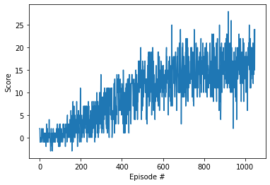

[//]: # (Image References)

[image1]: https://user-images.githubusercontent.com/10624937/42135619-d90f2f28-7d12-11e8-8823-82b970a54d7e.gif "Trained Agent"

# Project 1: Navigation

### Introduction

In this project, I tried to implement Deep Q-Network (DQN) Agent, one of most common value-based deep reinforcement learning algorithm.
The problem I solve is to collect yellow bananas in the large,square world.

![Trained Agent][image1]

#### The environment

A reward of +1 is provided for collecting a yellow banana, and a reward of -1 is provided for collecting a blue banana.  Thus, the **goal of your agent** is to collect as many yellow bananas as possible while avoiding blue bananas.  

The state space has **37** dimensions and contains the agent's velocity, along with ray-based perception of objects around agent's forward direction.  Given this information, the agent has to learn how to best select actions.  **Four** discrete actions are available, corresponding to:
- **`0`** - move forward.
- **`1`** - move backward.
- **`2`** - turn left.
- **`3`** - turn right.

The task is episodic, and in order to solve the environment, your agent must get an average score of +13 over 100 consecutive episodes.
And my agent can get 24 rewards with trained model.

#### Perparation

This environment is built on [Unity ml-agents](https://github.com/Unity-Technologies/ml-agents). Unlike OpenAI gym environment(of course, it has same OpenAI gym-styled environemt), it runs on independent executable frames, and requires several libraries related on graphics.
To build the model on ml-agents, some python packages are required to install

- tensorflow 1.7.1
- torch 0.4.0
- Pillow
- jupyter
- and so on

There are some [requirements](https://github.com/udacity/deep-reinforcement-learning/blob/master/python/requirements.txt) to keep in mind. All you need to is make virtual environment via anaconda, and install that required packages through `pip`.

Once you prepare the development environment, please follow the step in [here](https://github.com/udacity/deep-reinforcement-learning/tree/master/p1_navigation#getting-started)!
After you have followed the instructions above, open `Navigation.ipynb` (located in the `p1_navigation/`) through jupyter notebook and follow the instructions to learn how to use the Python API to control the agent.

<iframe width="560" height="315" src="https://www.youtube.com/embed/ltz2GhFv04A" title="YouTube video player" frameborder="0" allow="accelerometer; autoplay; clipboard-write; encrypted-media; gyroscope; picture-in-picture" allowfullscreen></iframe>

### Process

I followed several steps to implement DQN agent. All codes and archiecture is based on previous code example 'DQN on LunarLander-v2'

1. Define neural network architecture
  - I tried to use simple neural network that consists of fully-connected layer. Since this environment has discrete state space(37 dimensions) and discrete action space(4), so we don't need complex architecture. So I used 4 fc layers (state-in-value-out architecture) (64-128-64 nodes for each hidden layer) and ReLU activation function.
  
2. Define Experience Replay buffer.
  - DQN use off-policy TD target. That is, we can train it with sampling data in offline manners. And to enhance the sampling efficiency, we can store the experience tuple that face previousely and sample it for training.
  - Usually, sampling size (also known as batch size) is a hyperparameter.
  
3. Define Agent
  - In the original DQN paper, there are two identical networks, local network and target network. While the agent is trained with local network, the target network is fixed to make fixed target. It makes RL problem a sort of Supervised Learning. Of course, it requires several hyperparameters such as how long the period do we have to update the target network, or total size of epoch, buffer size to store and sample the experience tuple and so on.
  - At first, I used same hyperparameter on code example 'LunarLander-v2'. But I found that the state space in 'BananaWorld' is larger than 'LunarLander'. So I increased the **batch size** from 64 to 128. And I thought that as the larger as the state space is, the training is much harder. So it requires to fix the target much longer, and I changed the **update period** from 4 to 8
  - Also, I used another hyperparameter configuration like this:
  ```python
  BUFFER_SIZE = int(1e5)  # replay buffer size
  GAMMA = 0.99            # discount factor
  TAU = 1e-3              # for soft update of target parameters
  LR = 5e-4               # learning rate 
  ```
  - I follow the same agent architecture from previous code example.
  
4. Training
  - At last, the agent is played in training mode. I ran the 2000 episodes and when the average reward in 100 consequence step is larger than 16.3, then the training step stopped.
  - When the training is terminated successfully, I save the network model. We don't have whole network model, but model's weight with dictionary type.
  - It takes almost 1000 episodes.
  - plot for rewards per episode
  
  
5. Measure the performance under test mode.
  - I load the network model's weight on initial local network, and test it until its done. 
  - The trained model can get 24.0 reward.
  
### Lesson Learned

Of course, neural network architecture is important to solve the problem, but one of challengeable problem is tuning the hyperparameter. And it depends on the the environment that agent faced. It will be helpful to use traditional hyperparameter optimization like grid search or bayes optimization.